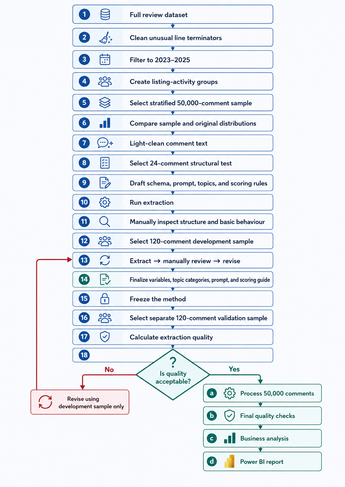
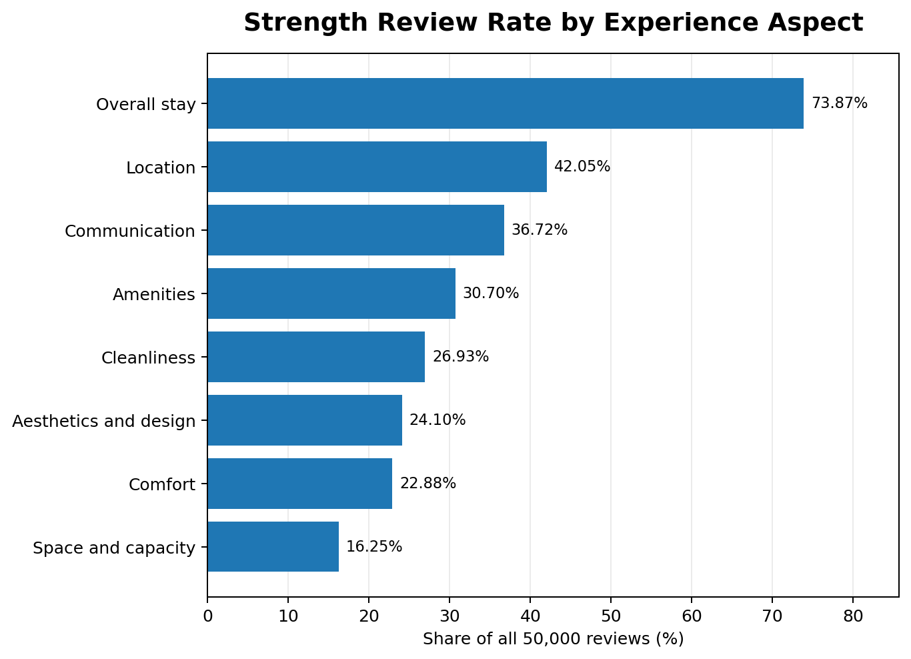
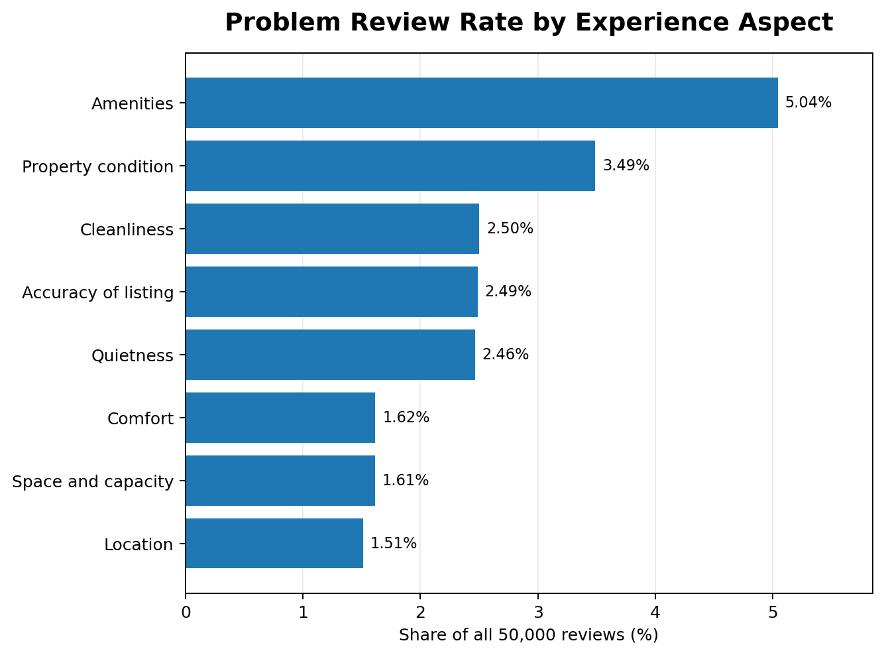
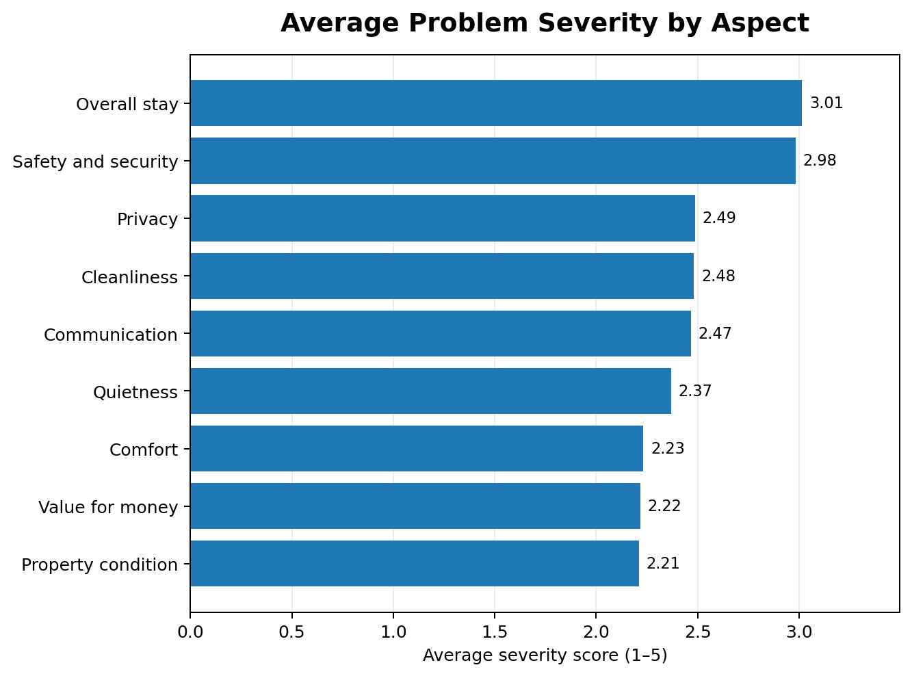
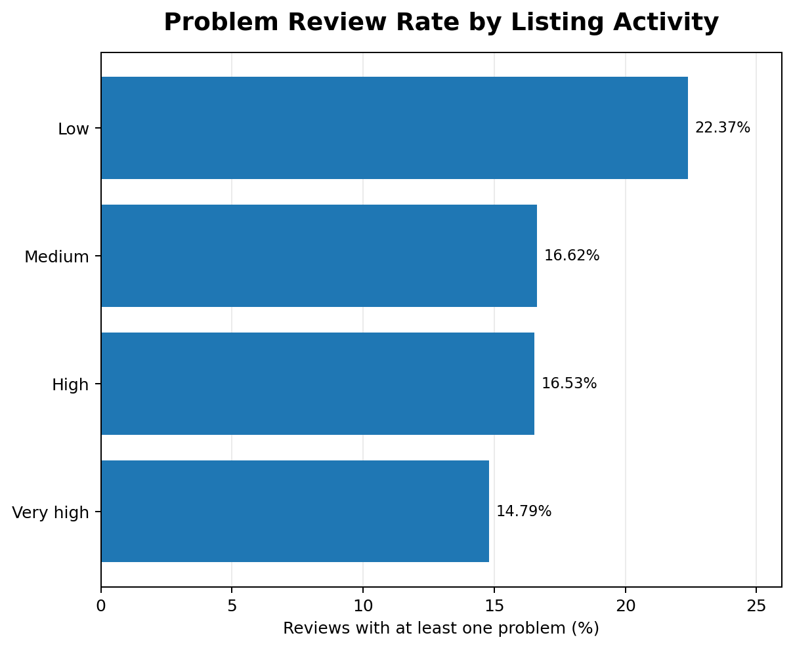
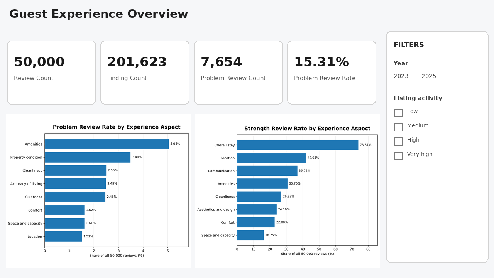
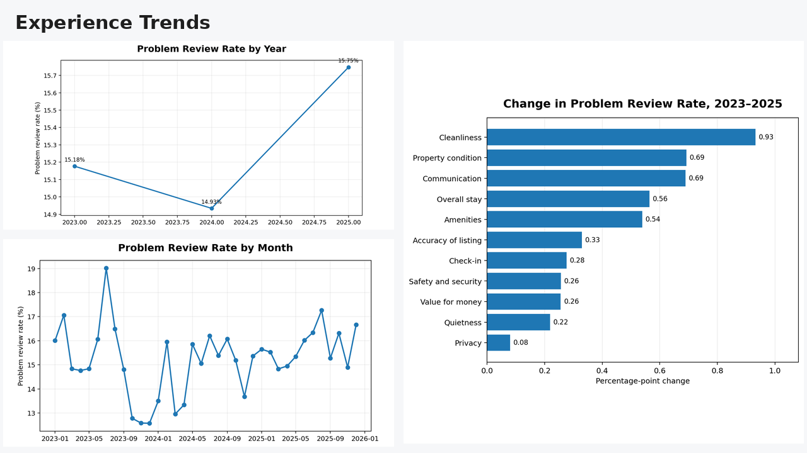
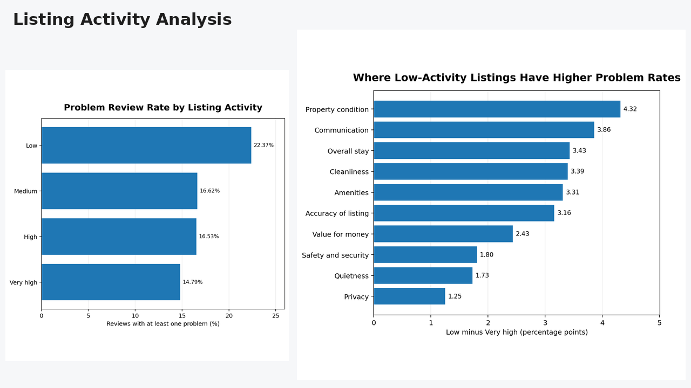
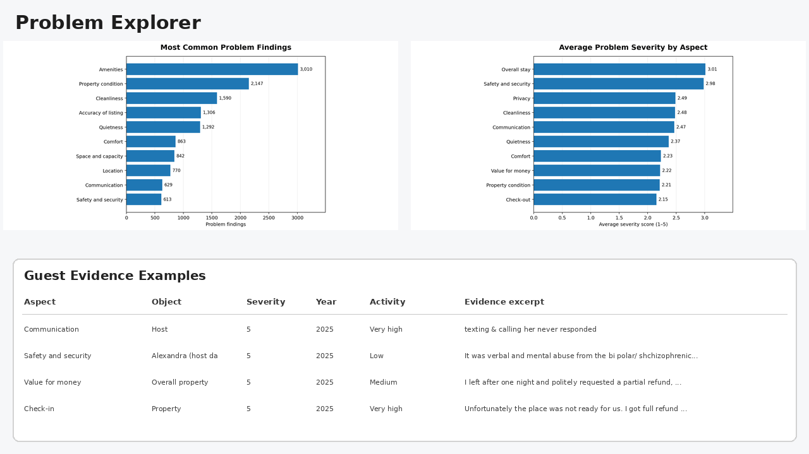

# Airbnb Guest Experience Intelligence

**Turning 50,000 Los Angeles Airbnb reviews into explainable strengths, risks, and business decisions**

This capstone project transforms large-scale unstructured Airbnb guest reviews into structured, analyzable customer-experience signals using Python, controlled LLM extraction, validation, and Power BI.

> **Central business question:** *Is this listing good for this type of guest?*

Instead of reducing each review to one sentiment label, the project separates reviews into distinct findings such as location, cleanliness, quietness, amenities, communication, property condition, safety, and value. This makes it possible to identify what guests value, what repeatedly goes wrong, how serious problems are, and how experience patterns differ across time and listing-activity groups.

---

## Project at a Glance

| Metric | Result |
|---|---:|
| Full-history review file | 1,785,848 reviews |
| Reviews from 2023–2025 | 898,164 |
| Usable reviews after cleaning | 896,716 |
| Final analytical sample | 50,000 reviews |
| Structured findings | 201,623 |
| Strength findings | 185,680 |
| Problem findings | 15,181 |
| Reviews with at least one problem | 7,654 |
| Overall problem-review rate | 15.31% |
| Exact evidence-quote rate | 97.63% |

### Quick Links

- [Power BI Dashboard](dashboard/airbnb_guest_experience_dashboard.pbix)
- [Capstone Analysis Report](reports/capstone_analysis.pdf)
- [Capstone Presentation](reports/capstone_presentation.pdf)
- [Public Sample Dataset](data/sample_reviews_120.csv)
- [Python Requirements](requirements.txt)

---

## Business Problem

Airbnb reviews contain rich customer-experience information, but they are difficult to use at scale.

A single review can contain multiple, sometimes conflicting, signals:

> *Great location, but the street was noisy at night.*

Traditional sentiment analysis may classify the review as simply positive, negative, or mixed. That loses the business detail needed for action.

This project instead converts review text into structured findings that support:

- clearer guest understanding of listing trade-offs;
- more specific host feedback;
- aspect-level problem and strength monitoring;
- preference-aware listing guidance;
- evidence-linked business analysis.

The project is designed as **decision support**, not as a production recommendation engine or factual verification system.

---

## End-to-End Analytical Workflow



The workflow follows five major stages:

1. **Prepare and clean the review data**
2. **Create a stratified 50,000-review sample**
3. **Develop and validate the extraction method**
4. **Run the frozen 50,000-review production extraction**
5. **Convert structured findings into business analysis and Power BI reporting**

The extraction method was frozen as `airbnb_extraction_v1.0` before the final production run.

---

## Project Scope and Sampling

- **Data source:** Public Los Angeles Airbnb review data from Inside Airbnb
- **Analysis period:** 2023–2025
- **Full-history review file:** 1,785,848 reviews
- **2023–2025 reviews:** 898,164
- **Usable reviews after basic cleaning:** 896,716
- **Final analytical sample:** 50,000 reviews

The final sample was stratified by both **review year** and **listing activity** to preserve the structure of the eligible review population while keeping LLM extraction feasible.

### Listing-Activity Groups

| Group | Eligible reviews per listing |
|---|---:|
| Low | 1–3 |
| Medium | 4–11 |
| High | 12–42 |
| Very high | 43+ |

The maximum distribution difference between the eligible population and final sample was below **0.002 percentage points** across the 12 year × activity strata.

A small public demonstration file is included at [`data/sample_reviews_120.csv`](data/sample_reviews_120.csv). It contains 10 reviews from each year × listing-activity stratum and excludes reviewer name, reviewer ID, and listing ID.

---

## Why Structured LLM Extraction?

The goal was not simply to summarize reviews.

Each review could produce multiple independent business-relevant findings. For example:

```text
"The apartment was beautiful and the location was perfect,
but the shower did not work and the host never replied."
```

could produce separate findings for:

- Aesthetics and design
- Location
- Property condition / amenities
- Communication

This preserves business meaning that would be lost in a single review-level sentiment score.

### Finding Schema

Each extracted finding contains:

| Field | Business meaning |
|---|---|
| `aspect` | Which guest-experience dimension is being evaluated |
| `object` | What business-relevant entity is involved |
| `observation` | What the guest experienced |
| `aspect_score` | Direction and strength of the evaluation, from -5 to +5 |
| `severity_score` | Practical seriousness of a negative finding, from 1 to 5 |
| `evidence_quote` | Exact review wording supporting the finding |
| `finding_category` | Strength, Problem, or Neutral |

---

## Controlled 18-Aspect Taxonomy

### Property & Physical
- Amenities
- Cleanliness
- Comfort
- Space and capacity
- Property condition
- Aesthetics and design

### Process & Interaction
- Communication
- Check-in
- Check-out
- Accuracy of listing

### Environment & Trust
- Location
- Quietness
- Safety and security
- Privacy
- Views

### Overall & Business
- Overall stay
- Value for money
- Other

The taxonomy was refined only when repeated classification gaps appeared during testing. The final prompt, Pydantic schema, scoring rules, and approved taxonomy were then frozen before production extraction.

---

## Extraction Validation and Quality Control

The LLM output was **not accepted blindly**.

The method was developed in stages:

1. **24-review structural test**  
   Covered all 12 year × listing-activity strata.

2. **120-review development sample**  
   Used to identify repeated classification issues and refine the schema, prompt, taxonomy, and scoring rules.

3. **Frozen production method**  
   Prompt, taxonomy, Pydantic schema, scoring logic, and production settings were locked before the final run.

4. **Five-part production extraction**  
   The 50,000 reviews were processed as five independent 10,000-review parts with checkpointing, retries, resume protection, shared cost controls, and final audits.

### Final Audit

| Quality check | Result |
|---|---:|
| Unique sampled comments | 50,000 |
| Structured findings | 201,623 |
| Duplicate comment IDs | 0 |
| Schema-invalid saved records | 0 |
| Score–severity consistency violations | 0 |
| Exact evidence quotes | 196,837 / 201,623 |
| Exact evidence-quote rate | 97.63% |

Findings assigned to `Other` were retained for audit/manual review and excluded from named-aspect rankings.

---

## Key Findings

### 1. Guest experience is strongly positive overall



| Aspect | Strength review rate |
|---|---:|
| Overall stay | 73.87% |
| Location | 42.05% |
| Communication | 36.72% |
| Amenities | 30.70% |
| Cleanliness | 26.93% |

**Business implication:** improvement efforts should not focus only on complaints. Repeated positive attributes should also be protected.

---

### 2. Problems are concentrated in operational areas



| Aspect | Problem review rate |
|---|---:|
| Amenities | 5.04% |
| Property condition | 3.49% |
| Cleanliness | 2.50% |
| Accuracy of listing | 2.49% |
| Quietness | 2.46% |

Amenities problems frequently involved issues such as parking and kitchen equipment, while property-condition findings captured maintenance and functionality problems.

**Business implication:** host feedback and operational improvement should prioritize frequent, actionable issues instead of treating all negative feedback as one category.

---

### 3. Frequency alone does not determine priority



Some problems occur less often but have greater practical impact.

- **Safety and security:** average problem severity **2.98**
- **Cleanliness:** average problem severity **2.48**

**Business implication:** issue prioritization should combine **frequency + severity + actionability**.

---

### 4. Overall problem prevalence was relatively stable, but the issue mix changed

| Year | Problem review rate |
|---|---:|
| 2023 | 15.18% |
| 2024 | 14.93% |
| 2025 | 15.75% |

The headline rate remained near 15%, but aspects such as cleanliness, property condition, communication, amenities, and safety showed increases worth monitoring.

This should be interpreted as a **change in issue mix**, not proof that the overall platform experience deteriorated.

---

### 5. Low-activity listings showed higher problem risk



| Listing activity | Problem review rate |
|---|---:|
| Low | 22.37% |
| Medium | 16.62% |
| High | 16.53% |
| Very high | 14.79% |

Low-activity listings showed larger gaps in operational areas such as property condition, communication, cleanliness, amenities, and listing accuracy.

**Business implication:** listing activity can be used as a screening or support signal, but not as a causal judgment or automatic penalty.

---

## Power BI Decision-Support Report

Python produces two analytical tables for Power BI:

### Reviews Table
One row per review.

Used for:
- review count;
- problem review count;
- problem review rate;
- year and month trends;
- listing-activity segmentation.

### Findings Table
One row per extracted finding.

Used for:
- aspect-level strengths and problems;
- finding counts;
- severity;
- object and observation drill-down;
- evidence-linked review excerpts.

The two tables are connected through an active one-to-many relationship on `comment_id`.

### Dashboard Pages

The interactive Power BI file is available here:

**[Download the Power BI dashboard](dashboard/airbnb_guest_experience_dashboard.pbix)**

The images below are static portfolio previews based on the final analytical outputs and dashboard page structure. The `.pbix` file remains the interactive source of truth.

#### 1. Guest Experience Overview



Overall KPIs, strength rates, problem rates, and filters.

#### 2. Experience Trends



Tracks how problem signals change over time.

#### 3. Listing Activity Analysis



Compares Low, Medium, High, and Very high activity groups.

#### 4. Problem Explorer



Drills from aggregate metrics into specific aspects, objects, observations, severity, and supporting review evidence.

---

## Business Recommendations

The analysis supports five practical actions:

1. **Build aspect-level review summaries**  
   Show strengths and risks separately instead of reducing a listing to one overall score.

2. **Prioritize actionable host feedback**  
   Focus on amenities, property condition, cleanliness, and listing accuracy while using severity to surface lower-frequency but high-impact risks.

3. **Support preference-aware guest decisions**  
   Allow guests to emphasize dimensions such as quietness, location, comfort, amenities, or value depending on their priorities.

4. **Monitor issue mix over time**  
   Track whether operational problem categories are becoming more or less common even when the overall problem rate remains stable.

5. **Use low-activity risk as a screening signal**  
   Higher problem prevalence among low-activity listings may justify additional support or monitoring, but should not be interpreted causally.

---

## Notebook Workflow

Run the notebooks in numerical order from the **project root**.

| Step | Notebook | Purpose |
|---|---|---|
| 1 | [`01_prepare_data.ipynb`](01_prepare_data.ipynb) | Clean the raw review file, retain 2023–2025 reviews, and prepare the eligible dataset. |
| 2 | [`02_sampling.ipynb`](02_sampling.ipynb) | Create listing-activity groups, build the stratified 50,000-review sample, and create development/test samples. |
| 3 | [`03_extraction_test.ipynb`](03_extraction_test.ipynb) | Test the structured extraction schema and prompt on small samples and review classification behavior. |
| 4 | [`04_full_extraction.ipynb`](04_full_extraction.ipynb) | Run the resumable five-part 50,000-review production extraction and final quality audit. |
| 5 | [`05_business_analysis.ipynb`](05_business_analysis.ipynb) | Produce review-level and finding-level metrics, trends, listing-activity comparisons, and Power BI-ready analytical outputs. |

Supporting files:

- [`extraction_config.py`](extraction_config.py) — frozen extraction schema, taxonomy, scoring rules, and prompt.
- [`src/final_extraction_workflow.py`](src/final_extraction_workflow.py) — production partitioning, checkpoint, cost-control, merge, and validation safeguards.

> **Important:** notebooks 3 and 4 contain API-related workflow logic. Do not use `Run All` unless you intentionally want to execute paid API calls and have configured the required environment correctly.

---

## Repository Structure

```text
airbnb-guest-experience-analysis/
│
├── README.md
├── requirements.txt
├── .gitignore
├── extraction_config.py
│
├── 01_prepare_data.ipynb
├── 02_sampling.ipynb
├── 03_extraction_test.ipynb
├── 04_full_extraction.ipynb
├── 05_business_analysis.ipynb
│
├── src/
│   ├── __init__.py
│   └── final_extraction_workflow.py
│
├── data/
│   └── sample_reviews_120.csv
│
├── dashboard/
│   └── airbnb_guest_experience_dashboard.pbix
│
├── images/
│   ├── workflow.png
│   ├── chart_01_top_strengths.png
│   ├── chart_02_top_problems.png
│   ├── chart_03_problem_severity.png
│   ├── chart_04_listing_activity_problem_rate.png
│   ├── powerbi_01_guest_experience_overview.png
│   ├── powerbi_02_experience_trends.png
│   ├── powerbi_03_listing_activity_analysis.png
│   └── powerbi_04_problem_explorer.png
│
└── reports/
    ├── capstone_analysis.pdf
    └── capstone_presentation.pdf
```

Large raw datasets, production extraction checkpoints, and full output files are intentionally excluded from the public repository.

---

## Reproducibility

Install the main Python dependencies with:

```bash
pip install -r requirements.txt
```

The public repository includes a small representative sample dataset for demonstration. Reproducing the complete 50,000-review extraction requires the original source data, the configured OpenAI API workflow, and paid API calls.

---

## Technology Stack

- Python
- pandas
- NumPy
- Matplotlib
- Pydantic
- OpenAI API
- Jupyter / VS Code
- Power BI

---

## Reports and Project Files

- [Capstone Analysis Report](reports/capstone_analysis.pdf)
- [Capstone Presentation](reports/capstone_presentation.pdf)
- [Power BI Dashboard](dashboard/airbnb_guest_experience_dashboard.pbix)
- [Public Sample Dataset](data/sample_reviews_120.csv)

---

## Limitations

This analysis should be interpreted as structured **review intelligence**, not absolute truth.

Key limitations include:

- public review data only;
- no Airbnb booking, conversion, search, payment, customer-profile, or support data;
- reviews reflect subjective guest perceptions;
- LLM extraction can misclassify vague, multilingual, or context-dependent language;
- a small portion of evidence excerpts did not pass exact-match validation;
- listing-activity groups differ substantially in sample size;
- observed relationships should not be interpreted as causal effects.

Direct review excerpts should only be displayed when their evidence has passed exact-match validation.

---

## Project Takeaway

This project demonstrates how large-scale qualitative feedback can be transformed into structured, explainable business intelligence.

**From:** millions of unstructured guest comments  
**To:** measurable strengths, risks, severity signals, trends, segments, and evidence-linked business actions

The central lesson is that customer feedback becomes more useful when it is kept **specific, traceable, and decision-oriented** rather than collapsed into one generic sentiment score.

---

## Author

**Hailey Yu**  
DATA 475 Capstone Project
